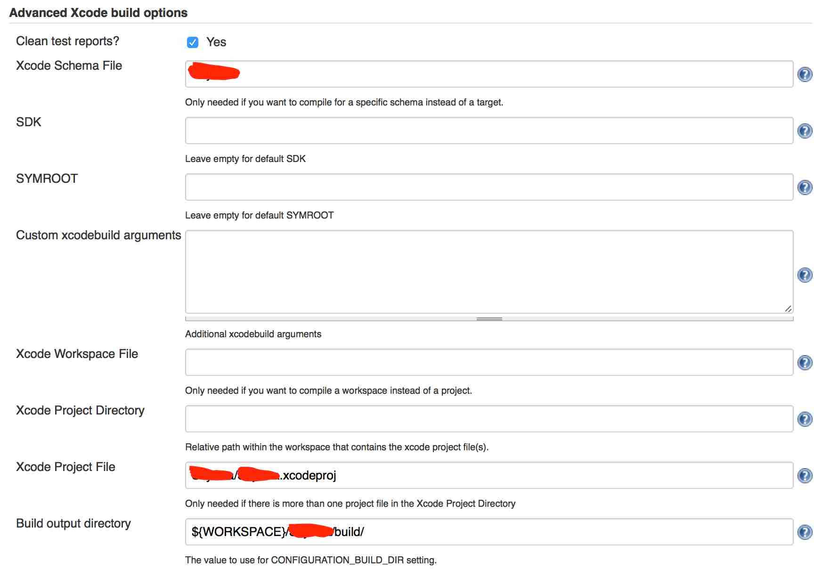
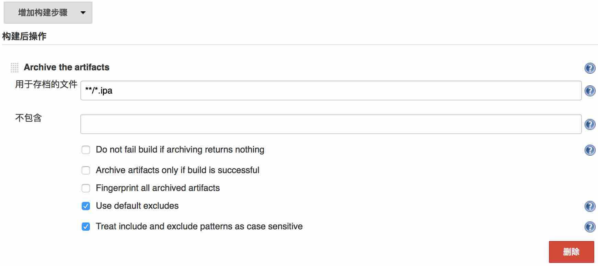

Jenkins For iOS By Mac
===============================

* **笔记:**  [惊梦](mailto:wuhaijin168@163.com)
* **日期:**  2016年11月14日

目录
===
- 资源
- Jenkins安装;
- Jenkins插件安装安装;
- Jenkins配置;
- 内容
- 测试

## 资源
* iMac(10.11.6);
* Xcode(8.1);
* Jenkins;(可持续集成化工具，贯穿本文的主角)
* GitBlit;(git服务器都行)

### Jenkins安装
1.[下载jenkins](https://jenkins.io),下载最新版本的Jenkins的war包;

2.将解压包放到指定目录(本人一般放在用户的根目录，或者放在`/usr/local/Cellar/`下)

3.也可直接使用命令`brew install jenkins`安装(本人就是这么干的简单快捷)；

4.命令启动`jenkins`；

5.[http://localhost:8080](http://localhost:8080)(浏览器默认地址端口);

### Jenkins插件安装安装
1.打开jenkins的`系统管理(如图)->插件管理(如图)`安装`Git plugin (获取git服务器代码)和 Xcode integration(iOS项目编译打包使用)`其他的一些插件比如`SSH`等jenkins会默认安装，如没有在可选插件中找到安装即可；
######系统管理

######插件管理

######选择所需插件

### Jenkins配置
1.打开首页->点击【新建】如图填写完成后单机OK。

2.由首页进入项目的【配置】如图：


3.使用git插件获取源码，如图：

【Credentials】目前有三种方式添加，如图单机【Add】弹出如下选择：

例如使用用户名和密码

4.构建触发器暂时没用到

5.点击【增加构建步骤】增加Xcode构建（Xcode integration插件起作用了）；

6.Xcode 全局配置，这里的`$(...)`是系统变量也可以是自定义的变量,【Target】和【Configuration】可以在项目的更目录下通过`xcodebuild -list`命令得到：

7.Xcode 证书打包配置（目前使用Xcode的不同版本Target的不同证书配置，这一步就省事多了）：

8.Xcode 编译前的配置，【Scheme】可以在项目的更目录下通过`xcodebuild -list`命令得到：

如果是【WorkSpace】项目，使用如下配置：

9.也可点击【增加构建步骤】添加【Execute shell】脚本，并且顺序可以移动调整：

10.Xcode 编译完成后的配置：


### Jenkins变量
1.系统变量，如：
```
${targetName}，${SHORT_VERSION}，${JOB_NAME}_${VERSION}_${BUILD_DATE}_${BUILD_NUMBER}，${branch_project}，${HOME}
```
等

2.自定义的变量如上的参数化构建。

### 备注
1.XcodeBuild部分命令：

`xcodebuild -version`

`xcodebuild -list`