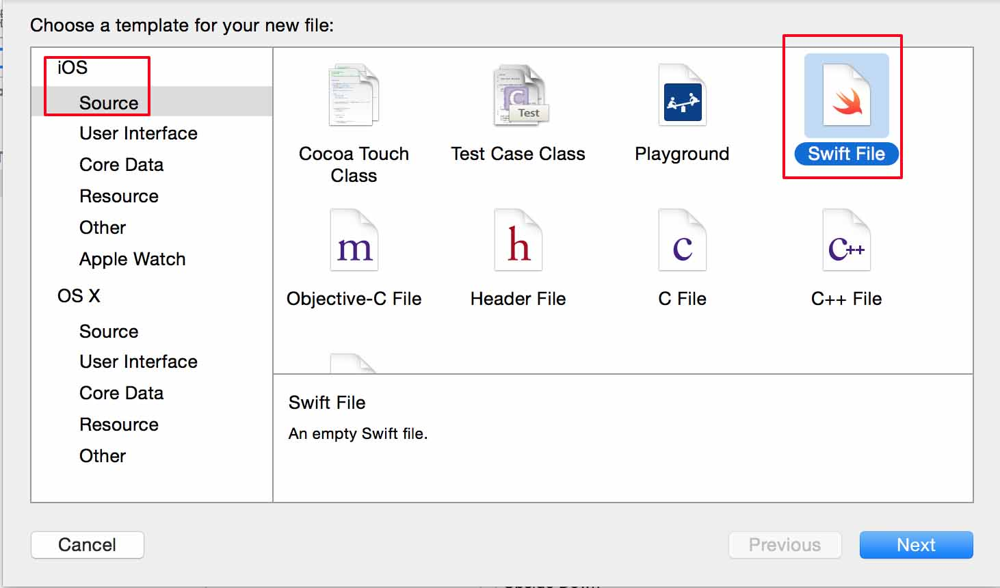
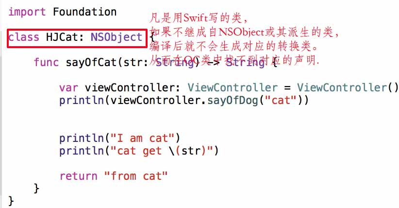
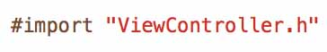
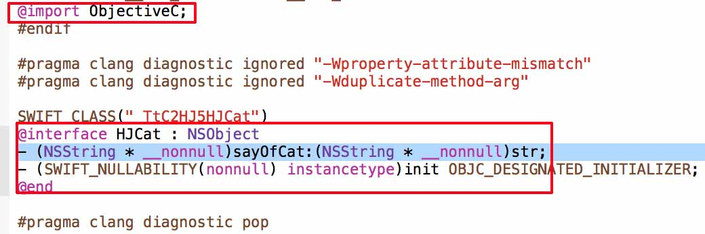

OC And Swift Mixed
========================

* **笔记:**  [惊梦](mailto:wuhaijin168@163.com)
* **日期:**  2015年07月22日

目录
===
- OC项目添加Swift文件
- Swift项目添加OC文件
- 注意
- 总结

OC项目添加Swift文件
-----------------------
1. 新建以OC为编译语言的项目HJDog`File->New->Project...`。

2. 新建Swift文件HJCat.swift`File->New->File...->iOS->Swift->Next`。

单击创建按钮时会出现`Would you like to configure an OC bridging header?`的提示框。
 
3. 单击YES，会生成两个文件`(HJCat.swift和PrjectName-Bridging-Header.h即HJDog-Bridging-Header.h)`，这是为Swift调用OC文件准备的头文件。

4. 在`HJCat.swift`添加`HJCat`类和`sayOfCat`方法.

5. 在`ViewCotroller.h`添加头文件`#import "名称-swift.h"`即`#import 
 "HJDog-swift.h"`。
  
6. 在`ViewCotroller`添加`sayOfCat`方法.
  
 

Swift项目添加OC文件
-----------------------
1. 继上面第二点生成的`PrjectName-Bridging-Header.h`文件，把需要swift文件调用的OC的`.h`文件放入其中，工程内的所有wift文件都可以调用。

注意
---
1. 凡是用Swift写的类，如果不继成自NSObject或其派生的类，编译后就不会生成对应的转换类。从而在OC类中找不到对应的声明。
2. 如果了解Swift搜索头文件`HJDog-Bridging-Header.h`和`targets->build settings ->Objective-C Bridging Header`在配置文件的关系，就可以自己建一个`.h`文件与配置文件关联。

3. 注意:你在整个项目里是找不到这个头文件的`#import "项目名-swift.h"`，但是你可以追踪`(Comd+单击)`查看此头文件。
 
4. **名称**是可以随意更改，但是**-swift.h**是不变的，而且需要和配置  文件`targets->build settings ->packing->Product Module Name`中的文件名一致，该类就可以调用工程里的任意一个swift文件。

总结
---
1. OC调Swift:添加`#import "名称-swift.h"`，`名称`与`targets->build settings ->packing->Product Module Name`一致。
2. Swift调OC:添加`.h`到`桥接名.h`，`桥接名`与`targets->build settings ->OC Bridging Header`一致。
