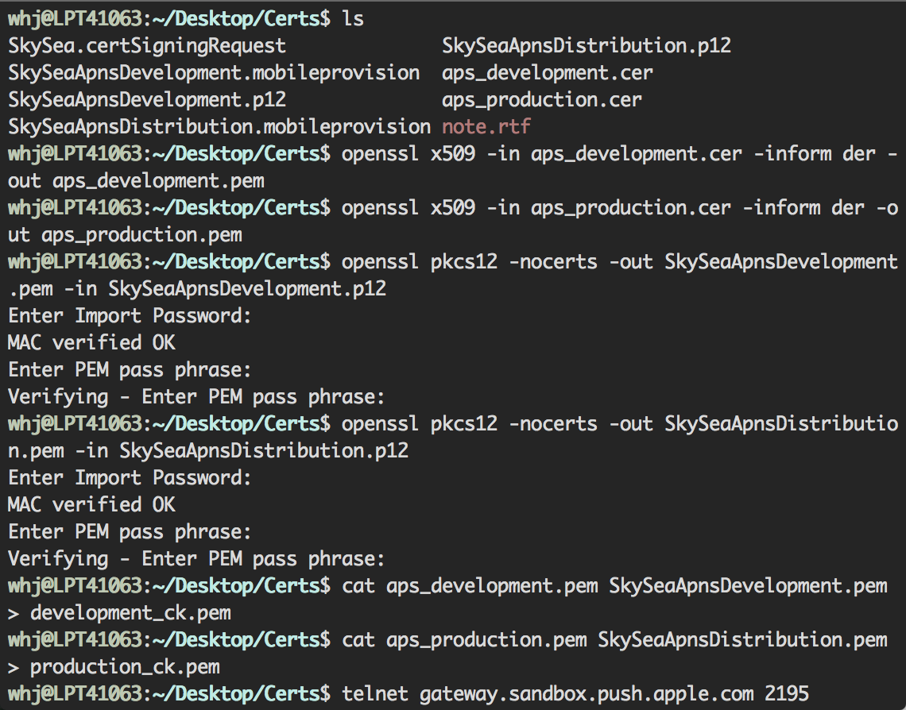

Apple Push Notification Service
===============================

* **笔记:**  [惊梦](mailto:wuhaijin168@163.com)
* **日期:**  2015年09月15日

目录
===
- 证书制作
- 证书合并
- 测试

证书制作
-------
1. 制作`development`和`production`证书，过程基本一样,成对出现。在创建APPID是记得勾选`Push Notifications`,然后是`*.certSigningRequest`文件，接下来是`*.cer`文件，最后因为APNs需要真机测试所以`*.mobileprovision`文件。
2. 需要部署所以需要到钥匙串`KeyChain`中导出`*.p12`文件。

证书合并
-------
1. PHP服务部署需要合并证书，进入证书所在目录，执行如下图：

2. 所需命令：
    
    	openssl x509 -in aps_development.cer -inform der -out aps_development.pem
    	
    	openssl pkcs12 -nocerts -out SkySeaApnsDevelopment.pem -in SkySeaApnsDevelopment.p12
    	
    	cat aps_development.pem SkySeaApnsDevelopment.pem > development_ck.pem
    	
    	telnet gateway.sandbox.push.apple.com 2195
    	
    	openssl s_client -connect gateway.sandbox.push.apple.com:2195 -cert aps_development.pem -key SkySeaApnsDevelopment.pem
    	
3. 推送地址：
 		
 		测试 development：gateway.sandbox.push.apple.com:2195
 		
 		发布 production：gateway.push.apple.com:2195
		
		
测试
----
1. 创建测试工程,`Bundle Identifier`和创建的推送APPID的一致。修改`ApplicationDelegate.m`文件如下：
		
		- (BOOL)application:(UIApplication *)application didFinishLaunchingWithOptions:(NSDictionary *)launchOptions {
    
    	//消息推送注册
   	 	[application registerForRemoteNotificationTypes:(UIRemoteNotificationTypeBadge | UIRemoteNotificationTypeSound | UIRemoteNotificationTypeAlert)];
    
   		 //判断是否由远程消息通知触发应用程序启动
   		if ([launchOptions objectForKey:UIApplicationLaunchOptionsRemoteNotificationKey]!=nil) {
        
        //获取应用程序消息通知标记数（即小红圈中的数字）
        NSInteger badge = [UIApplication sharedApplication].applicationIconBadgeNumber;
        	if (badge > 0) {
           		 badge = 0;
            	[UIApplication sharedApplication].applicationIconBadgeNumber = badge;
        		}
    		}
   	 		return YES;
		}

		- (void)application:(UIApplication *)application didRegisterForRemoteNotificationsWithDeviceToken:(NSData *)deviceToken {
    
   		 NSLog(@"didRegisterForRemoteNotificationsWithDeviceToken: %@", deviceToken);
		}

		- (void)application:(UIApplication *)application 		didFailToRegisterForRemoteNotificationsWithError:(NSError *)error {
    
   		 NSLog(@"didFailToRegisterForRemoteNotificationsWithError: 		%@", 		error);
		}

		- (void)application:(UIApplication *)application 		didReceiveRemoteNotification:(NSDictionary *)userInfo {
    
   		 NSLog(@"didReceiveRemoteNotification: %@", userInfo);
		}

2. 通过[PushMeBaby](https://github.com/stefanhafeneger/PushMeBaby),下载后，导入`*.cer`文件，在`Copy Bundle Resource`查看确保已添加。
3. 修改`ApplicationDelegate.m`如下：

		- (id)init {
			self = [super init];
	 		if(self != nil) {
				self.deviceToken = @"3cc8f2c1 b4b8257a 9072178a 0318319d 36067892 e687a787 3a826a57 a846e11b";
				self.payload = @"{\"aps\":{\"alert\":\"This is some skysea message.\",\"badge\":3,\"sound\":\"defalut\"},}";
				self.certificate = [[NSBundle mainBundle] 	pathForResource:@"aps_development" ofType:@"cer"];
			}
			return self;
		}
		
4. 接收到推送消息的格式：

		didReceiveRemoteNotification: {
    		aps =     {
       			 alert = "This is some skysea message.";
        		 badge = 3;
        		 sound = defalut;
    				};
				}