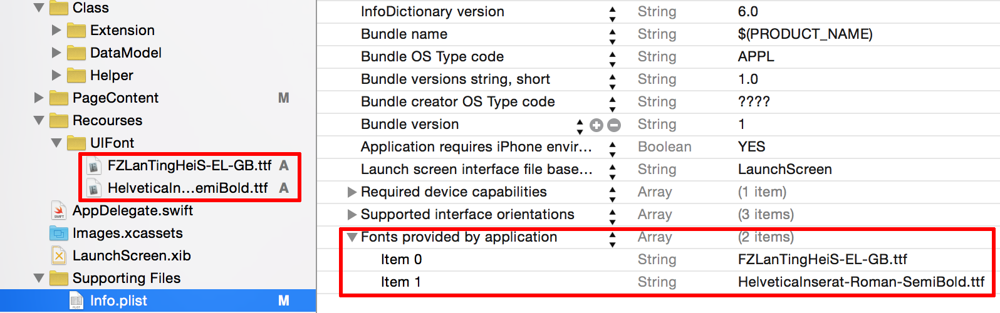

iOS添加字体库xxx.ttf
==================

* **整理：** [惊梦](mailto:wuhaijin168@163.com)
* **日期：** 2015年09月04日

###目录 

- 添加
- 使用

添加xxx.ttf字体库
---------------
1. 将字体库（xxx.ttf）添加到工程里：
2. 在工程的info.plist里添加新的一行`Fonts provided by application`为`Array`类型，并将字体库的名称添加进去： 
3. 在Build Phases->Copy Bundle Resources检查xxx.ttf是否已被添加，否则添加： 

使用已添加的字体库
---------------
1. 查找已添加字体库的名称：
   - a.在Mac下双击字体文件，在标题栏中找到字体的`fontName`字体库名称：
   - b.打印出系统所有的字体名，查找到字体的`fontName`字体库名称：
   
			//遍历字体UIFont SWIFT
			 for fontfamilyname in UIFont.familyNames() {
                 println("fontfamilyname==>>: \(fontfamilyname)")
                 for fontName in UIFont.fontNamesForFamilyName(fontfamilyname as! String) {
                     println("fontName: \(fontName)")
                 }
        	 } 

2. 字体库的使用：
   + a.在.xib中使用： 
   
   + b.在代码中使用：
   
   		 lable.font = UIFont(name: "xxx", size: 15)
   			
     
