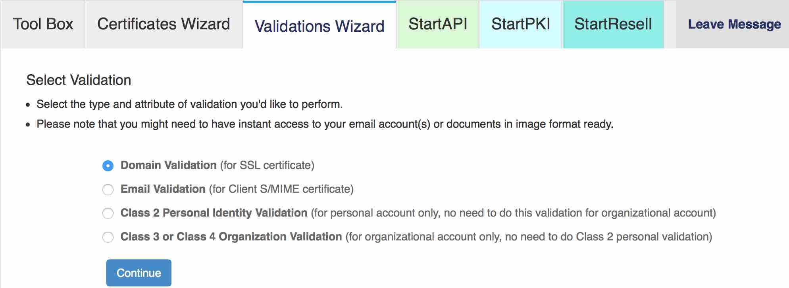
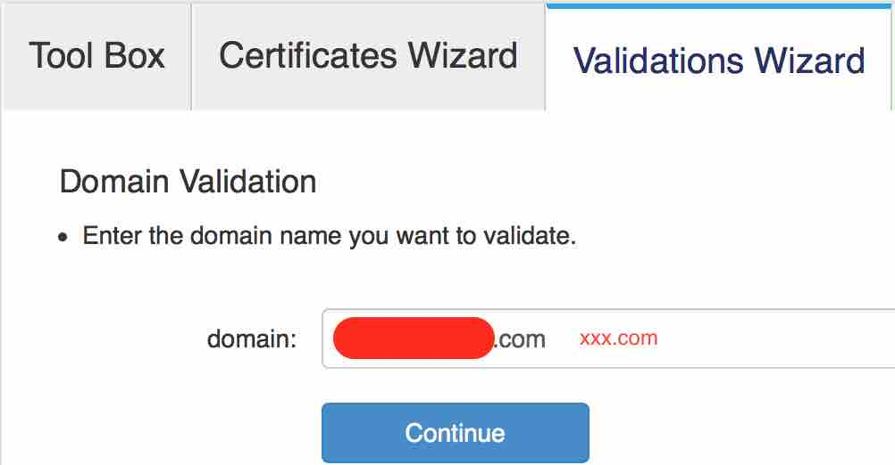
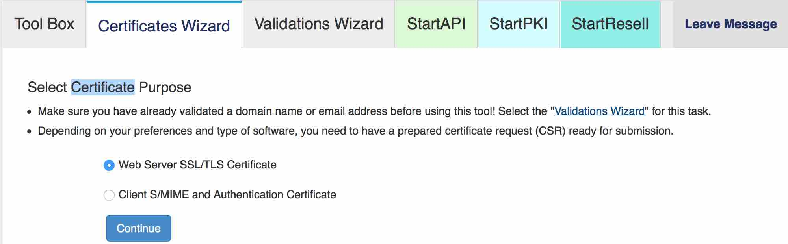
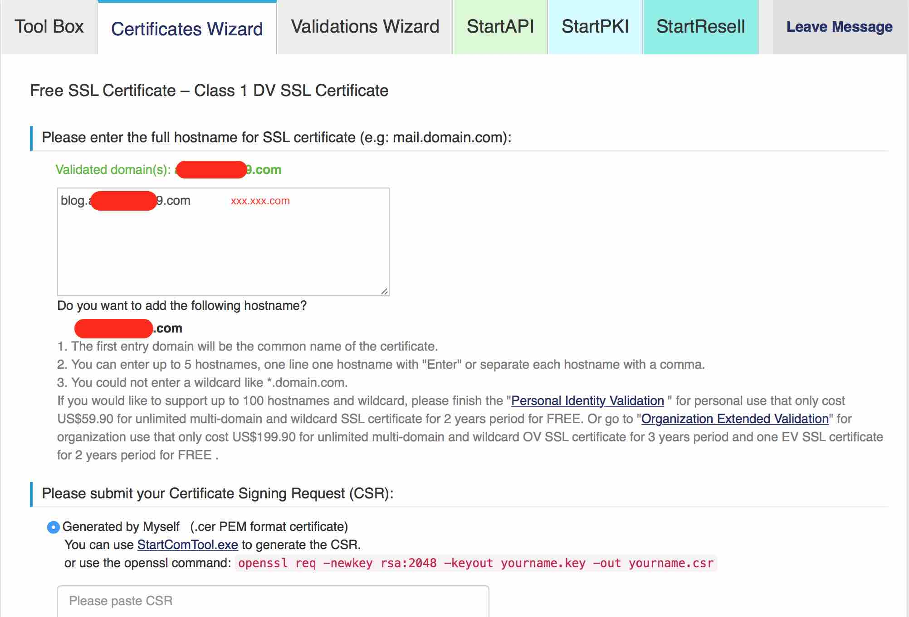
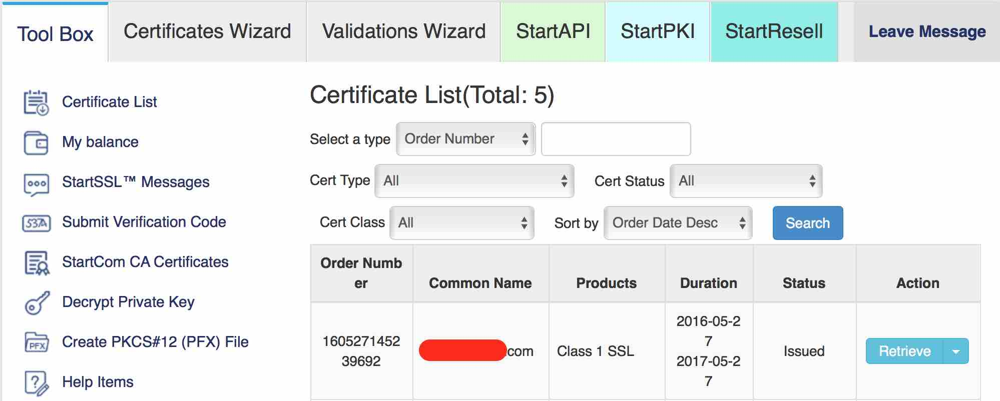
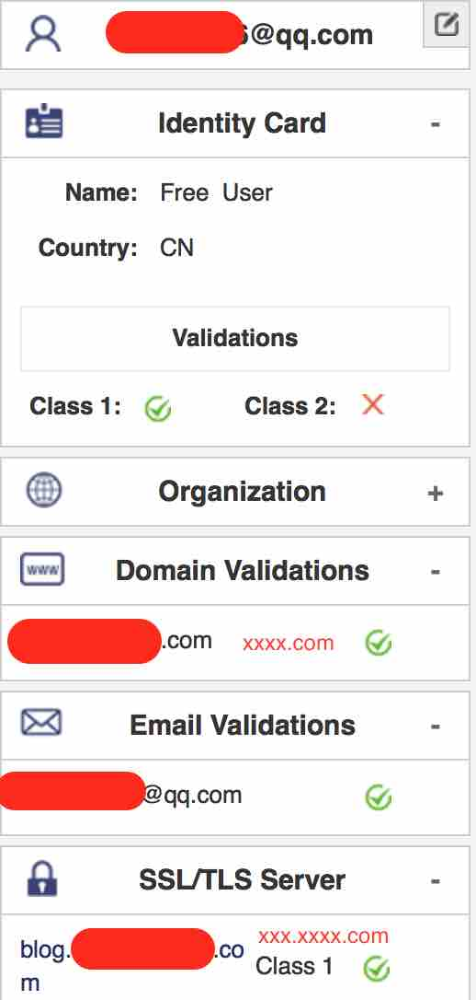

[Startssl申请](https://startssl.com)
===========

* **整理：** [吴海金](mailto:632234936@qq.com)
* **日期：** 2016年05月31日
* **更新日期：** 2016年05月31日

目录
---

- Validation Wizard；
- Certificate Wizard;
- Tool Box;

内容
---
* **Validation Wizard**
	1. 验证域名：
	
	
	2. 输入域名：
	

* **Certificate Wizard**

	1. 生成SSL证书：
	
	2. 输入有关信息：
		a. 域名可以是xxx.xxxx.com与服务器的访问地址一致，xxxx.com是域名，xxx是二级域名;
		b. CSR证书，可以通过如下命令生成，得到xxx.key和xxx.csr两个文件，经验证在不在目标服务器生成都行只要证书对应就行：
		
		```
		openssl req -newkey rsa:2048 -keyout yourname.key -out yourname.csr
		```
		c.使用如下命令抓去xxx.csr文件，将得到的证书copy的指定的框内：
		
		```
		cat .../.csr
		```
	
	
* **Tool Box**

	1. 下载（Tool Box -> Certificate List -> Retrieve）：
	
	
	
	
	2. 有关信息：
	
	
	
	
备注
===


